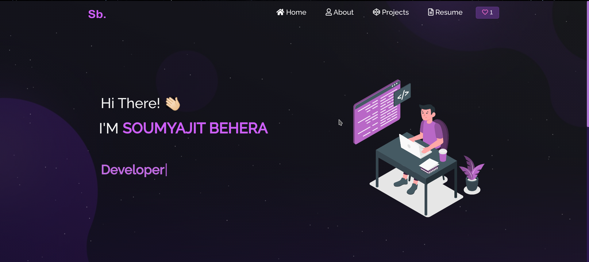

# Personal Portfolio Website

## Overview
Modern and responsive portfolio website built with React.js, showcasing my projects and skills.



## Technologies Used
- React.js
- Bootstrap
- CSS3 (Custom Animations)
- Node.js
- JavaScript (ES6+)

## Features
- 🌓 Dark/Light Theme
- 📱 Fully Responsive Design
- ✨ Modern UI/UX
- 🎯 Interactive Components
- 🚀 Optimized Performance
- 🎨 Custom Animations

## Live Demo
[View Portfolio](https://cusnirovmaxim.github.io/portfolio/)

## Installation and Setup
1. Clone the repository
```bash
git clone https://github.com/CusnirovMaxim/portfolio.git
```

2. Install dependencies
```bash
cd portfolio
npm install
```

3. Run development server
```bash
npm start
```

4. Build for production
```bash
npm run build
```

## Project Structure
```
portfolio/
  ├── src/
  │   ├── components/
  │   ├── Assets/
  │   ├── styles/
  │   └── App.js
  ├── public/
  └── package.json
```

## Contact
- Email: maximcusnirovvv@gmail.com
- GitHub: [@CusnirovMaxim](https://github.com/CusnirovMaxim) 